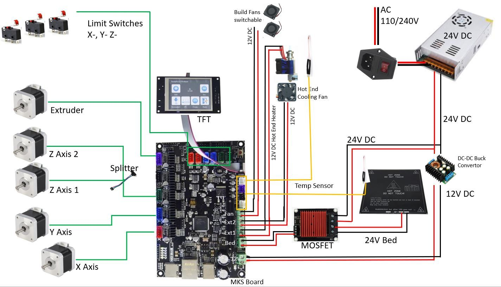

# 3D Pinter DIY
This repository discusses the 1st order approximation for the basic hardware behind the 3D printer schematic.

---

## Table of Contents
- [Open Questions](#open-questions)
- [Circuit Diagram](#circuit-diagram)
- [Assumptions of the Design](#assumptions-of-the-design)
    - [Drive Current Adjustment](#drive-current-adjustment)
    - [Motor Selection](#motor-selection) 
    - [MOSFET Selection](#mosfet-selection) 
    - [Power Suppy Selection](#power-supply-selection) 
- [Calculation of Loads](#calculation-of-loads)
     - [Motor Drivers](#motor-drivers) 
     - [Optocouplers](#optocouplers) 
     - [Hotend Heater](#hotend-heater) 
     - [Silicon Heater for Heatbed](#silicon-heater-for-heat-bed) 
     - [DC Fans](#dc-fans) 
     - [Total Load](#total-load) 
- [Decision](#decision)

---
## Open Questions

- What should be the servo motor rating?
- What is the rough estimation of the load?
- Which power supply should be used?

---

## Circuit Diagram

---
## Assumptions of the Design
The following assumptions have been made based on different sources:
### -Drive Current Adjustment
According to the [manual](http://sl3d.ch/wp-content/uploads/2019/11/MKS-Gen-L.pdf), the MKS motherboards consist of 5 motor drivers to drive the stepper motors. The motor drivers have different adjustment settings for driving steppers.

---
-**4988 (Red) Motor Driver:**

| Default Current Settings  | Maximum Current Settings |
|:---------:|:----------:|
|I = Vref / 1.6|**Imax = 1 A**|
|I = 0.8 / 1.6   |Vmax = I * 1.6|
|**I = 0.5 A**       |**Vmax = 1.6 V**  |

Maximum power dissipation, P1 = Imax * Vmax = 1.6 W (Each Phase)

Total power dissipation **PT1** = P1 * 4 = 4 * 1.6 = **6.4 W** (for 4 phases)

---
-**4988 (Blue) Motor Driver:**

| Default Current Settings  | Maximum Current Settings |
|:---------:|:----------:|
|I = Vref / 0.8|**Imax = 2 A**|
|I = 0.8 / 0.8   |Vmax = I * 0.8|
|**I = 1 A**       |**Vmax = 1.6 V**  |

Maximum power dissipation, P2 = Imax * Vmax = 3.2 W (Each Phase)

Total power dissipation **PT2** = P2 * 4 = 4 * 3.2 = **12.8 W** (for 4 phases)

---
-**DRV 9925 Motor Driver:**

| Default Current Settings  | Maximum Current Settings |
|:---------:|:----------:|
|I = Vref * 2|**Imax = 2.5 A**|
|I = 0.65 / 2   |Vmax = I / 2|
|**I = 1.3 A**       |**Vmax = 1.25 V**  |

Maximum power dissipation, P3 = Imax * Vmax = 3.125 W (Each Phase)

Total power dissipation **PT3** = P3 * 4 = 4 * 3.125 = **12.5 W** (for 4 phases)

---
-**LV 8729 Motor Driver:**

| Default Current Settings  | Maximum Current Settings |
|:---------:|:----------:|
|I = Vref / 0.5|**Imax = 1.5 A**|
|I = 0.4 / 0.5   |Vmax = I * 0.5|
|**I = 0.8 A**       |**Vmax = 0.75 V**  |

Maximum power dissipation, P4 = Imax * Vmax = 1.125 W (Each Phase)

Total power dissipation **PT4** = P4 * 4 = 4 * 1.125 = **4.5 W** (for 4 phases)

---

-**TMC 2100 Motor Driver:**

| Default Current Settings  | Maximum Current Settings |
|:---------:|:----------:|
||**Imax = 2.5 A**|
|  ||
|      |**Vmax = 5 V**  |

Maximum power dissipation, P5 = Imax * Vmax = 12.5 W (Each Phase)

Total power dissipation **PT5** = P5 * 4 = 4 * 12.5 = **50 W** (for 4 phases)

---

## Motor Selection
Based on the default current settings of the motor drivers, following stepper motors should be selected:
- For **4988 (Red)** motor driver, minimum **0.5 A, 0.8 V** stepper should be chosen.
- For **4988 (Blue)** motor driver, minimum **1 A, 0.8 V** stepper should be chosen.
- For **DRV 9925** motor driver, minimum **1.3 A, 0.65 V** stepper should be chosen.
- For **LV 8729** motor driver, minimum **0.8 A, 0.4 V** stepper should be chosen.
- For **TMC 2100** motor driver, minimum **2.5 A, 5 V** stepper should be chosen.

The motor selection also depends on the torque values. According to this [blog](https://duet3d.dozuki.com/Wiki/Choosing_an_extruder_drive), the stepper motor force depends on the printing filament diameter. 
- For **1.75 mm** PLA filament, the imposed force should be within 10 N ~ 25 N at rated motor current and aim to run at 50 % ~ 85 %
-  For **3 mm** filament, aim for 3 times the motor force, so between 30 N and 75 N at rated current.
- If using a **1.8 deg / step** motor, the extruder force in Newtons (N) is : 

**_Extruder_force_at_rated_current = Motor_holding_torque Extruder_steps_per_mm * 0.0014_**

- For a **0.9 deg / step** motor: 

**_Extruder_force_at_rated_current = Motor_holding_torque * Extruder_steps_per_mm * 0.0007_**
