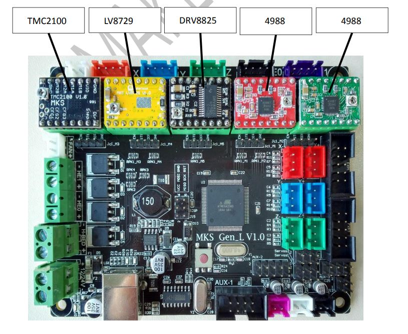

# 3D Pinter DIY
This repository discusses the 1st order approximation for the basic hardware behind the 3D printer schematic.

---

## Table of Contents
- [Open Questions](#open-questions)
- [Circuit Diagram](#circuit-diagram)
- [Assumptions of the Design](#assumptions-of-the-design)
    - [Drive Current Adjustment](#drive-current-adjustment)
    - [Motor Selection](#motor-selection) 
    - [MOSFET Selection](#mosfet-selection) 
    - [Power Suppy Selection](#power-supply-selection) 
- [Calculation of Loads](#calculation-of-loads)
     - [Motor Drivers](#motor-drivers) 
     - [Optocouplers](#optocouplers) 
     - [Hotend Heater](#hotend-heater) 
     - [Silicon Heater for Heatbed](#silicon-heater-for-heat-bed) 
     - [DC Fans](#dc-fans) 
     - [MOSFET](#mosfet) 
     - [Total Load](#total-load) 
- [Discussion](#discussion)

---
## Open Questions

- What should be the servo motor rating?
- What is the rough estimation of the load?
- Which power supply should be used?

---

## Circuit Diagram

---
## Assumptions of the Design
The following assumptions have been made based on different sources:
### Drive Current Adjustment
According to the [manual](http://sl3d.ch/wp-content/uploads/2019/11/MKS-Gen-L.pdf), the MKS motherboards consist of 5 motor drivers to drive the stepper motors. The motor drivers have different adjustment settings for driving steppers.

---
-**4988 (Red) Motor Driver:**

| Default Current Settings  | Maximum Current Settings |
|:---------:|:----------:|
|I = Vref / 1.6|**Imax = 1 A**|
|I = 0.8 / 1.6   |Vmax = I * 1.6|
|**I = 0.5 A**       |**Vmax = 1.6 V**  |

Maximum power dissipation, P1 = Imax * Vmax = 1.6 W (Each Phase)

Total power dissipation **PT1** = P1 * 4 = 4 * 1.6 = **6.4 W** (for 4 phases)

---
-**4988 (Blue) Motor Driver:**

| Default Current Settings  | Maximum Current Settings |
|:---------:|:----------:|
|I = Vref / 0.8|**Imax = 2 A**|
|I = 0.8 / 0.8   |Vmax = I * 0.8|
|**I = 1 A**       |**Vmax = 1.6 V**  |

Maximum power dissipation, P2 = Imax * Vmax = 3.2 W (Each Phase)

Total power dissipation **PT2** = P2 * 4 = 4 * 3.2 = **12.8 W** (for 4 phases)

---
-**DRV 9925 Motor Driver:**

| Default Current Settings  | Maximum Current Settings |
|:---------:|:----------:|
|I = Vref * 2|**Imax = 2.5 A**|
|I = 0.65 / 2   |Vmax = I / 2|
|**I = 1.3 A**       |**Vmax = 1.25 V**  |

Maximum power dissipation, P3 = Imax * Vmax = 3.125 W (Each Phase)

Total power dissipation **PT3** = P3 * 4 = 4 * 3.125 = **12.5 W** (for 4 phases)

---
-**LV 8729 Motor Driver:**

| Default Current Settings  | Maximum Current Settings |
|:---------:|:----------:|
|I = Vref / 0.5|**Imax = 1.5 A**|
|I = 0.4 / 0.5   |Vmax = I * 0.5|
|**I = 0.8 A**       |**Vmax = 0.75 V**  |

Maximum power dissipation, P4 = Imax * Vmax = 1.125 W (Each Phase)

Total power dissipation **PT4** = P4 * 4 = 4 * 1.125 = **4.5 W** (for 4 phases)

---

-**TMC 2100 Motor Driver:**

| Default Current Settings  | Maximum Current Settings |
|:---------:|:----------:|
|-|**Imax = 2.5 A**|
| - |-|
|   -   |**Vmax = 5 V**  |

Maximum power dissipation, P5 = Imax * Vmax = 12.5 W (Each Phase)

Total power dissipation **PT5** = P5 * 4 = 4 * 12.5 = **50 W** (for 4 phases)

---

## Motor Selection
Based on the default current settings of the motor drivers, the following stepper motors should be selected:
- For **4988 (Red)** motor driver, a minimum **0.5 A, 0.8 V** stepper should be chosen.
- For **4988 (Blue)** motor driver, a minimum **1 A, 0.8 V** stepper should be chosen.
- For **DRV 9925** motor driver, a minimum **1.3 A, 0.65 V** stepper should be chosen.
- For **LV 8729** motor driver, a minimum **0.8 A, 0.4 V** stepper should be chosen.
- For **TMC 2100** motor driver, a minimum **2.5 A, 5 V** stepper should be chosen.

The motor selection also depends on the torque values. According to this [blog](https://duet3d.dozuki.com/Wiki/Choosing_an_extruder_drive), the stepper motor force depends on the printing filament diameter. 
- For **1.75 mm** PLA filament, the imposed force should be within 10 N ~ 25 N at rated motor current and aim to run at 50 % ~ 85 %
-  For **3 mm** filament, aim for 3 times the motor force, so between 30 N and 75 N at rated current.
- If using a **1.8 deg / step** motor, the extruder force in Newtons (N) is : 

**_Extruder_force_at_rated_current = Motor_holding_torque Extruder_steps_per_mm * 0.0014_**

- For a **0.9 deg / step** motor: 

**_Extruder_force_at_rated_current = Motor_holding_torque * Extruder_steps_per_mm * 0.0007_**

---
## MOSFET Selection
 
To drive the **24 V - 400 W** silicone heater for the heatbed, choosing a power MOSFET would be much useful in terms of efficiency, power estimation, and power consumption. It's easier to choose a MOSFET based on the '**Rds (on resistance)**' and '**Vds (operating voltage)**' values. Choosing **Rds** < **1 mohm** can reduce the power dissipation to a great extent. Thus, the heat sink is not necessary to use. The **Vds** can be chosen 60 % ~ 100 % more than the required voltage. This [mosfet](
https://www.infineon.com/dgdl/Infineon-IAUC120N04S6L005-DataSheet-v01_00-EN.pdf?fileId=5546d46275b79adb0175e129ada610b6) or any similar kind can be chosen for this purpose. The **IAUC120N04S6L005** MOSFET has the following specifications:
- **Vds** is 40 V (60 % more than the required 24 V)
- **Id** is 120 A (much higher than the required 25 A)
- **Rds** is 0.55 mohms (which will create less power dissipation across the MOSFET)

---
## Power Supply Selection

A good guideline for choosing the power supply for 3D printer DIY is mentioned in this [blog](https://3dprinterchat.com/3d-printer-power-supply/). An **ATX power supply with 80 plus gold** should be chosen for this purpose. This power supply has the following advantages:
- Cheap
- Wide range of fixed voltages
- Great protections embedded (short-circuit, wrong voltage input, wrong frequency input)
- Easily replaceable (under 5 min)
- Power factor correction
- Widely available
- Can be turned off automatically at the end of a printing

**80 plus gold** signifies the following:

| Load  | Efficiency |
|:---------:|:----------:|
| 20 % | 87 % |
| 50 % | 90 % |
| 100 % | 87 % |

---
## Calculation of Loads

The final load calculation is mentioned below:

---

### Motor Drivers
Total power dissipation across the motor drivers is, **Ptd** = Pt1 + Pt2 + Pt3 + Pt4 + Pt5 = (6.4 + 12.8 + 12.5 + 4.5 + 50) Watts = **86.2 Watts**

---
### Optocouplers
According to this fruitful [discussion](https://3dprinting.stackexchange.com/questions/8297/hooking-up-an-optocoupler-in-a-24v-machine-is-a-2-kohm-resistor-sufficient) a **24 V- 60 mA** optocoupler can be chosen for this application. 

The power disssipation across the 6 optocouplers is, **Pto** = 6 * V * I = (6 * 24 * 0.06) Watts = **8.64 Watts**

---

### Hotend Heater

The power disssipation across the **24 V- 40 W** hotend heater is, **Pth** = **40 Watts**

---

### Silicon Heater for Heatbed

The power disssipation across the **24 V- 400 W** silicon heater for heatbed is, **Pts** = **400 Watts**

---

### DC Fans

The power disssipation across the 4 DC fans of **24 V, 0.15 A, 6020** model is, **Ptf** = 4 * V * I = (4 * 24 * 0.15) Watts = **14.4 Watts**

---

### MOSFET

The power disssipation across the **40 V, 120 A, 0.55 mohms** MOSFET is, **Ptm** = I^2 * Rds = (25^2 * 0.00055) Watts = **0.344 Watts**

---

### Total Load

The total power dissipation across the schematic is = Ptd + Pto + Pth + Pts + Ptf + Ptm = (86.2 + 8.64 + 40 + 400 + 14.4 + 0.344) Watts = 549.584 Watts ~ **550 Watts**

---

## Discussion

According to this [blog](https://3dprinterchat.com/3d-printer-power-supply/), for a printer with 30 cm × 30 cm heated bed: 600 W power supply should be chosen. This approximation also verifies the validity of the load calculation done above. If **80 plus gold** standard is chosen:
- When the printer will be idle (20 % of load, 110 W): 87 % of power (522 W) will be available for sourcing, which is sufficient.
- When the printer will be active (50 % of load, 275 W): 90 % of power (540 W) will be available for sourcing, which is sufficient.
- When the printer will be active (100 % of load, 550 W): 87 % of power (522 W) will be available for sourcing, which is sufficient. Please note that, the maximum current rating is chosen for the motor driver load calculation. Thus the **Ptd** will be much lower than the calculated one.

So, to meet the 550 Watts of load requirement, choosing a **600 Watts ATX power supply with 80 plus gold** would be wise.

---
